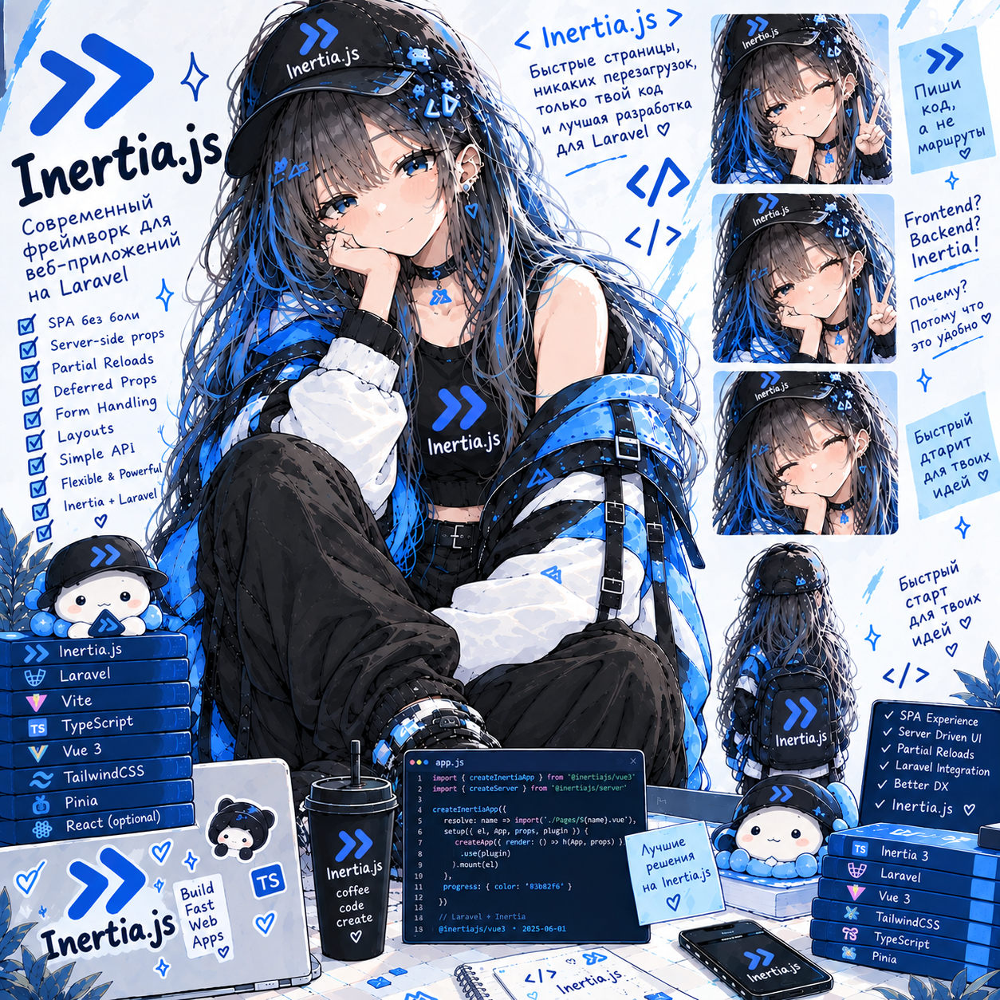

# Inertia Lab — Inkwell, блог-платформа

**Статус: ⚪ методичка вычитана и проверена запуском (04.10.2026), прохождение впереди.**
**Сложность: средняя.** Проект самостоятельный (свой репозиторий `inertia-lab`), кода из других лаб не берёт. Предполагается знакомство с Laravel (контроллеры, Eloquent, FormRequest, Policies — на уровне Laravel Lab) и с Vue 3 (Composition API — на уровне Vue Lab); сам мост Inertia объясняется с нуля.

## О чём

Блог-платформа **Inkwell** на Laravel 13 + Inertia 3 + Vue 3 + TypeScript, собранная без starter kit — так, чтобы каждый слой моста между бэкендом и фронтендом был разобран руками, а не принят на веру. Протокол Inertia (объект страницы, XHR-визиты, конфликт версий, 303-редиректы) → props как публичный API (API Resources, `optional`/`defer`/`merge`/`once`) → полный путь формы и валидации без 422 → SSR и его типичные поломки (hydration mismatch, Pinia-утечка между посетителями). Три роли — reader, author, editor — на `Policies`, без дублирования прав на фронте.

## Стек

Laravel 13 (PHP 8.4), `inertiajs/inertia-laravel` + `@inertiajs/vue3` ^3, Vue 3 (`<script setup lang="ts">`), TypeScript strict + `vue-tsc`, Pinia (только клиентское состояние), Laravel Wayfinder (типизированные маршруты), Tailwind CSS 4, SQLite, PHPUnit + `assertInertia`. SSR — встроенный Node-процесс Inertia 3, без отдельного сервера в dev.

## Формат

Методичка [`Inertia_Lab_Inkwell.html`](Inertia_Lab_Inkwell.html) — открывается в браузере, прогресс по чекбоксам сохраняется локально. У каждого шага: код → «зачем» → «🔬 под капотом» (раскрывается) → что почитать/посмотреть перед следующим.

## Что внутри (5 сессий, ~16,5 ч)

- **Сессия 1** (~3,5 ч) — протокол и фундамент: чистый Laravel без starter kit, Inertia руками (сервер и клиент), протокол curl-запросами, модель данных, лента на ресурсах, layout и shared data, типизированные маршруты (Wayfinder)
- **Сессия 2** (~3 ч) — страница поста: контроллер и SEO-мета-теги (OpenGraph), SSR — включаем, ломаем, чиним, комментарии при прокрутке (`Inertia::merge`)
- **Сессия 3** (~3,5 ч) — пользователи и формы: аутентификация на сессиях руками, flash-уведомления и первый Pinia-store, комментарии и лайки (error bag, оптимистичные обновления), роли и Policies, студия автора, редактор поста (`useForm`, файлы, автосохранение)
- **Сессия 4** (~3,5 ч) — данные и производительность: поиск и фильтры в URL, бесконечная лента и prefetch, дашборд автора на отложенных props, polling без визита (`usePoll`), модерация и шифрование истории
- **Сессия 5** (~3 ч) — тесты (`assertInertia`), сборка и запуск в продакшн-режиме с SSR, Production Hell — задания без подсказок

Разделы 1–8 методички — теория (протокол, объект страницы, итоговая архитектура, стек, props как API, сценарий жизненного цикла поста, формы и валидация, SSR и SEO), раздел 9 — пять сессий заданий, разделы 10–13 — чек-лист, глоссарий, вопросы для собеседования, что дальше.

---

Часть сборного репозитория лабораторных работ — [anitech-performance](https://github.com/meeymirita/anitech-performance).
